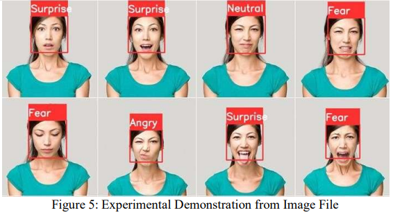
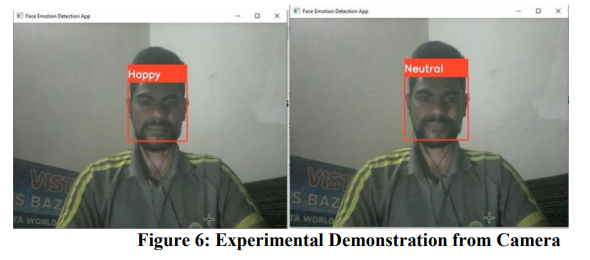

# Face Emotion Detection 

The goal of this project is to develop a program that can detect the emotion of a person based on a picture of the face. The program should be able to detect the following emotions: "Angry", "Disgust", "Fear", "Happy", "Sad", "Surprise" and "Neutral". The program should be able to detect multiple faces in a picture and assign an emotion to each face. 


## Installation in Local Machine
1. Clone the repository
```bash
git clone https://github.com/AbdurRaahimm/Face-Emotion-Detection.git
```

2. Install the required libraries
```bash
pip install cv2
pip install numpy
pip install keras
```

3. Run the program
```bash
python `file_name`
```

## screenshots




## Connect on Social Media
- [Twitter](https://twitter.com/AbdurRahim4G)
- [Instagram](https://www.instagram.com/abdurrahim4g/)
- [Facebook](https://www.facebook.com/Rahim72446)
- [LinkedIn](https://www.linkedin.com/in/abdur-rahim4g/)
- [YouTube](https://youtube.com/@AbdurRahimm)
